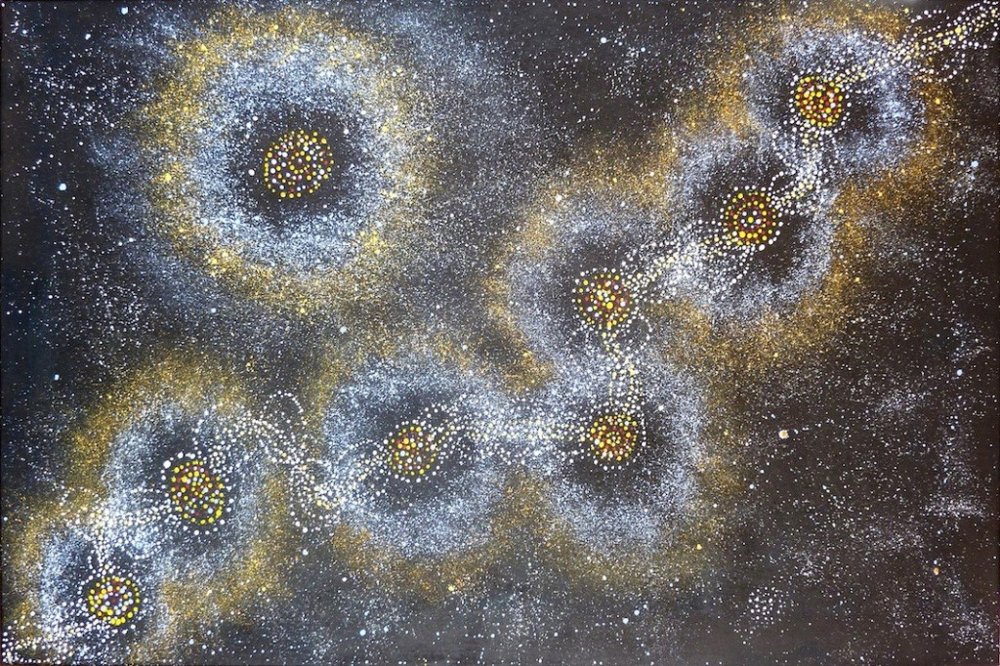

# Individual Part: Interactive Circular Patterns

## Instructions

1. **Interaction**:
   - Move the mouse to the bottom, click the “play/pause” button to start or stop the audio, and wait for the music to start. The animation will then dynamically respond to the music. 

2. **Experience the Animation**:
   - The interactive part uses audio to adjust the size of the circular patterns according to the audio frequencies. 

## Individual Approach to Animation

### Animation Driver
I chose **audio analysis** (using FFT) to drive the animation. The circular patterns adjust their size and colors dynamically based on the music frequencies.

### Unique Animated Properties
These patterns dynamically adjust their sizes based on audio frequencies, creating a lively and engaging visual effect. To enhance this, I selected an audio track with rich dynamics to make the animation more vibrant and responsive.

These properties are unique to my implementation, ensuring a distinct visual style compared to my group members.

## Inspiration

   I took inspiration from stars as their sizes change dynamically and it gives off a dreamy vibe when you look at it. An artwork that inspired me to dynamically adjust the size of the circular patterns based on audio frequencies is “Stars or Seven Sisters Dreaming” by ALMA. As stars are known to bring luck, this aligns with the message of “Wheels of fortune”, therefore I have implemented a dynamic audio to change the size of the circular pattern to replicate stars. 

- "Stars or Seven Sister Dreaming" by ALMA

## Technical Explanation

### How It Works
I have used a function to preload the audio file that I have downloaded to change the size of the circular pattern dynamically. Then, I used the Fast Fourier Transform (FTT) to analyze and visualise the frequency spectrum of the audio file I had preloaded. The `numBins` is set at 4096 and `smoothing` at 0.7 for a smoother animation. The spectrum values are mapped to a range to control the size scaling of circular patterns. Furthermore, to animate the image I have added `adjustSize(scaleFactor)` method modifies the radius of each pattern using the spectrum values so the circular patterns pulse in sync with the music. Lastly, the interactive was conducted through the implementation of a toggle play/pause button for audio with a function to trigger to activate the music. Ultimately, these were added to the group code to effectively animate the circular patterns based on the audio frequencies that are toggled by a button at the bottom of the canvas.

### References
- **p5.js Sound Library**: Used for FFT-based audio analysis.

    - p5.js. (n.d.). *P5.fft.* https://p5js.org/reference/p5.sound/p5.FFT/ 